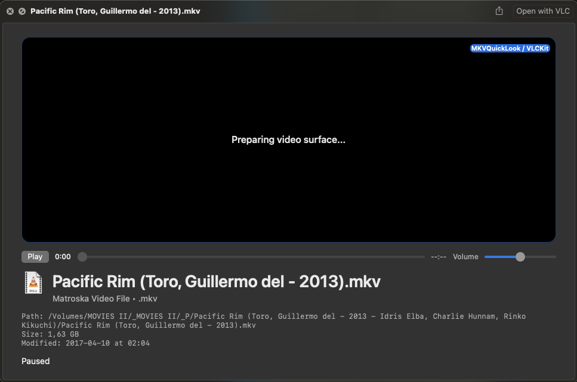

# MKVQuickLook

Version: `0.1.3` (`build 4`)

macOS host app plus Quick Look Preview Extension scaffold for:

- `mkv`
- `webm`
- `ogg` / `ogv`
- `opus` (audio-only)
- `avi` (best-effort)

`MKVQuickLook` provides a Finder Quick Look preview for these formats on macOS by shipping a small host app with a bundled Quick Look Preview Extension and embedded `VLCKit` playback backend.



## Gatekeeper

This app is currently distributed as an ad hoc signed DMG build and is **not notarized**.

- macOS Gatekeeper may warn when users open it for the first time.
- That is expected for the current release process.
- Users may need to open it via Finder context menu or allow it in System Settings after the first launch attempt.

Current status:

- host app with main window, settings/help UI, and playback lab
- Quick Look Preview Extension registered for owned target file types
- `VLCKit 3.7.2` fetched into `Vendor/` by a bootstrap script
- direct VLCKit-backed playback path for supported files
- audio-only `.opus` files use the same VLCKit backend with an audio preview UI instead of a video frame
- Finder registration and Launch Services ownership wired into the app bundle metadata
- playback defaults to paused in Quick Look
- renderer, metadata, and UI regressions covered by automated tests

## Bundling

`VLCKit` is bundled automatically as part of this app.

- It does not need to be pre-installed on the Mac.
- The app does not download it at runtime.
- The framework is downloaded for development by `./scripts/bootstrap-vlckit.sh` into `Vendor/VLCKit.xcframework`.
- During the build, Xcode embeds `VLCKit.framework` into the Quick Look extension bundle at:
  `MKVQuickLook.app/Contents/PlugIns/MKVQuickLookPreviewExtension.appex/Contents/Frameworks/`

This means the shipped app is self-contained with respect to the playback backend.

## Requirements

- macOS 14 or later
- Xcode 16.2 or later recommended
- `xcodegen` if you want to regenerate the project from `project.yml`

## Project Files

- `project.yml`: XcodeGen spec
- `MKVQuickLook.xcodeproj`: generated Xcode project
- `CHANGELOG.md`: versioned change history
- `scripts/bootstrap-vlckit.sh`: downloads the pinned official VideoLAN binary package
- `Vendor/`: local dependency install location created by the bootstrap script

Repository policy:

- release artifacts in `dist/` are local build outputs and must not be committed
- large local sample media belongs in `example-videos/` and must not be committed
- `VLCKit` is fetched on demand rather than committed into Git history
- vendored debug symbols are intentionally not kept because they add hundreds of megabytes and are not required to build or run the app

## Build

Fetch the pinned `VLCKit` package first:

```sh
./scripts/bootstrap-vlckit.sh
```

If you just cloned the repo and `Vendor/` looks empty or incomplete, that is expected. The binary dependency is no longer committed to Git history and must be populated locally by the bootstrap script.

Generate the project if needed:

```sh
xcodegen generate
```

Build from the command line without signing:

```sh
xcodebuild \
  -project MKVQuickLook.xcodeproj \
  -scheme MKVQuickLook \
  -configuration Debug \
  -destination 'platform=macOS' \
  CODE_SIGNING_ALLOWED=NO \
  build
```

## Install Locally

Build, copy to `~/Applications`, refresh Quick Look, and open the app once:

```sh
./scripts/install-local.sh
```

That script also applies ad hoc bundle signatures to the framework, extension, and app bundle, because plain `CODE_SIGNING_ALLOWED=NO` debug builds are not enough for reliable Quick Look extension registration.

`install-local.sh` automatically bootstraps `VLCKit` first if it is missing.

Refresh Quick Look manually without reinstalling:

```sh
./scripts/reset-quicklook.sh
```

## Build A Release DMG

Create a release-style DMG in `dist/`:

```sh
./scripts/build-release-dmg.sh
```

What this script does:

- bootstraps `VLCKit` if needed
- builds the app in `Release`
- applies ad hoc signatures to the framework, extension, and app bundle
- stages the app with an `Applications` symlink
- creates `dist/MKVQuickLook-v<version>.dmg`

This is suitable for GitHub Releases. It is not notarized.

`dist/` is ignored by Git. Build the DMG locally, then upload it to a GitHub Release instead of committing it into the repository history.

## Publish A GitHub Release

The downloadable DMG should be published as a GitHub Release asset, not as a tracked repo file.

### Web UI

1. Open the GitHub repository.
2. Click `Releases`.
3. Click `Draft a new release`.
4. Create or select a tag such as `v0.1.3`.
5. Set the release title, for example `v0.1.3`.
6. Upload the DMG from `dist/`.
7. Publish the release.

### GitHub CLI

If `gh` is installed:

```sh
git tag v0.1.3
git push origin v0.1.3

gh release create v0.1.3 dist/MKVQuickLook-v0.1.3.dmg \
  --title "v0.1.3" \
  --notes-file CHANGELOG.md
```

That gives users a normal release download page while keeping the Git repository smaller and cleaner.

## Automatic GitHub Releases

This repository now includes a GitHub Actions workflow at [`.github/workflows/release.yml`](/Users/robertwildling/Desktop/_WWW/_MKVQuickLook/.github/workflows/release.yml).

Behavior:

- pushing a tag matching `v*` triggers the workflow
- the workflow bootstraps `VLCKit`
- the workflow runs the non-GUI test suite
- it builds the DMG with `./scripts/build-release-dmg.sh`
- it creates or updates the GitHub Release for that tag
- it uploads the generated DMG as a release asset

Typical release flow:

```sh
git push origin main
git tag v0.1.3
git push origin v0.1.3
```

That is the correct trigger model for this project. Releasing on every plain `git push` would be the wrong design.

Important:

- the DMG asset does not appear instantly on the Release page
- GitHub first shows the automatic source archives
- the DMG appears only after the GitHub Actions `Release` workflow finishes successfully
- if the DMG is missing, check the `Actions` tab first

## Local Testing

1. Build the app in Xcode or with `xcodebuild`.
2. Install it with `./scripts/install-local.sh` or copy it to an Applications folder.
3. Launch the app once.
4. In Finder, select a supported file and press Space.

Notes about the current samples:

- `example-videos/*.mkv` resolves to `org.matroska.mkv`
- `example-videos/*.webm` resolves to `org.webmproject.webm`
- `example-videos/*.avi` resolves to `public.avi`
- the current `example-videos/big_buck_bunny_240p.ogg` sample resolves to audio on this system, not Theora video

So if you want to validate the original Ogg/Theora requirement specifically, add a real `.ogv` or Theora-in-Ogg sample.

## Developer Test Media

Large sample media files must not be committed to this repository.

For local development, create a folder named `example-videos/` at the repo root and place your test files there. That folder is intentionally ignored by Git so each developer can keep local fixtures without bloating the repository history.

Suggested local contents:

- one or more `.mkv` files, including at least one problematic real-world sample
- one `.webm` file
- one `.opus` audio-only sample
- one `.ogv` or Theora-in-Ogg sample if Ogg video support is being tested
- one `.avi` sample if AVI behavior is being checked

Keep those files local only. If reproducible media fixtures are needed for automated tests, prefer tiny purpose-built samples or generated fixtures instead of large real-world files.

## Developer Dependency Setup

After a fresh clone, run:

```sh
./scripts/bootstrap-vlckit.sh
```

This downloads the pinned official `VLCKit 3.7.2` binary package from VideoLAN, verifies its checksum, and installs only the files this repo needs into `Vendor/`.

The install and release scripts also call this automatically, but it is still the correct first setup step for developers.

In other words:

1. clone the repo
2. run `./scripts/bootstrap-vlckit.sh`
3. build, test, install, or create a DMG

Do not treat an empty `Vendor/` after clone as a broken repo state. That is now the intended setup.

What is intentionally not included:

- large sample media in `example-videos/`
- generated release artifacts in `dist/`
- committed `VLCKit` runtime binaries
- vendored `VLCKit` debug symbols

If the dependency strategy changes later, the README must be updated so the required bootstrap step is impossible to miss.

If Finder does not refresh the extension state:

```sh
qlmanage -r
qlmanage -r cache
```

You may also need to relaunch Finder.

## Playback Diagnostics

The app now emits timestamped playback control logs through the unified logging system with:

- subsystem: `com.robertwildling.MKVQuickLook`
- category: `Playback`

To watch live control latency while using Finder Quick Look or the in-app Playback Lab:

```sh
log stream --style compact \
  --predicate 'subsystem == "com.robertwildling.MKVQuickLook" AND category == "Playback"'
```

To inspect recent history:

```sh
log show --style compact --last 5m \
  --predicate 'subsystem == "com.robertwildling.MKVQuickLook" AND category == "Playback"'
```

What gets logged:

- seek slider UI begin/change/end
- controller handoff
- player seek request / coalesced apply / final apply
- first VLC time-change callback after seek
- volume slider UI change
- controller handoff
- player volume apply
- player state transitions

For volume, compare:

- `[volume] ui-change`
- `[volume] controller-change`
- `[volume] apply`
- `[volume] metrics`

For seeking, compare:

- `[seek] ui-begin` / `[seek] ui-change` / `[seek] ui-end`
- `[seek] controller-begin` / `[seek] controller-change` / `[seek] controller-end`
- `[seek] request`
- `[seek] apply-coalesced` or `[seek] apply-final`
- `[seek] time-changed`

If lag remains after `apply`, the remaining delay is downstream in VLCKit / decode / output buffering rather than in the Swift control path.

## Next Step

Validate current control behavior in Finder on macOS 14 and 15, then tighten unsupported-codec handling and release packaging.
